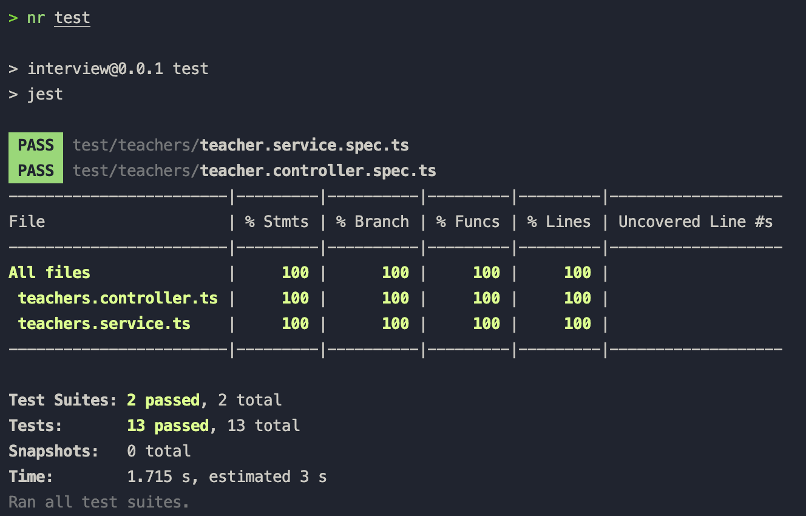
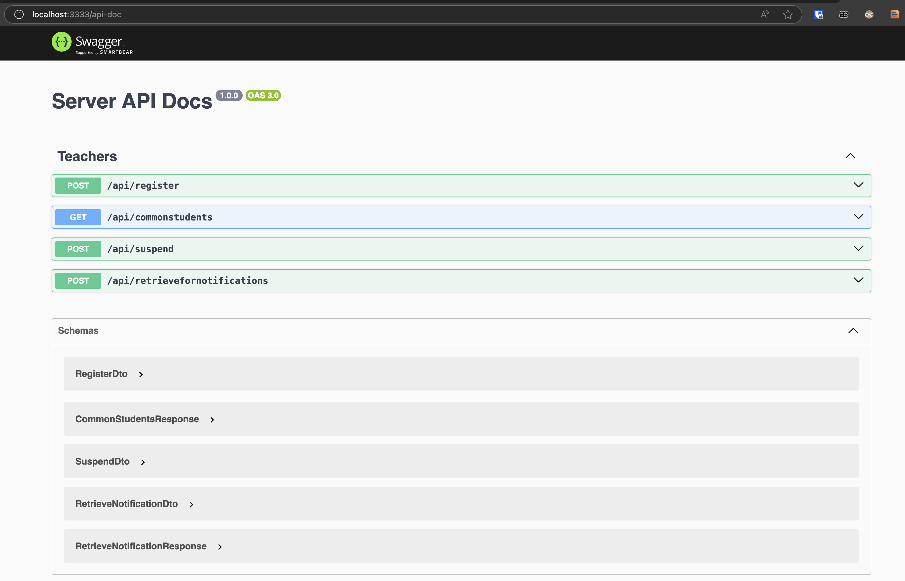

# NodeJS API Assignment

## Overview

NodeJS API Assignment is a backend service designed to help teachers perform administrative functions for their students. It's built using the NestJS framework, offering robust API endpoints for clients.

## Table Of Content
- [NodeJS API Assignment](#nodejs-api-assignment)
  - [Overview](#overview)
  - [Table Of Content](#table-of-content)
  - [Features](#features)
  - [Approach](#approach)
    - [Technologies](#technologies)
    - [Generate source structure](#generate-source-structure)
    - [Choose a development method](#choose-a-development-method)
    - [Develop APIs and unit test](#develop-apis-and-unit-test)
    - [More ideas](#more-ideas)
  - [Tech stacks](#tech-stacks)
  - [Source structure](#source-structure)
  - [Test coverage](#test-coverage)
  - [How to run](#how-to-run)
    - [Pre-requisites](#pre-requisites)
    - [Installation](#installation)
    - [Environment setup](#environment-setup)
    - [Run docker compose](#run-docker-compose)
    - [Seeding](#seeding)
  - [Development](#development)
    - [Database Migrations](#database-migrations)
    - [Seeding](#seeding-1)
    - [Start application](#start-application)
    - [Run test with coverage](#run-test-with-coverage)
  - [Production](#production)
    - [Build application](#build-application)
  - [How to test](#how-to-test)
    - [Using Swagger UI (Recommend)](#using-swagger-ui-recommend)
    - [Using Postman File](#using-postman-file)
  - [Note](#note)
  - [Contact](#contact)

## Features

- Teacher can register students.
- Teacher can retrieve a list of students common to a given list of teachers.
- Teacher can suspend a specified student.
- Teacher can retrieve a list of students who can receive a given notification.

## Approach

### Technologies

- Choose a library or framework to develop APIs.
- There are many options for this such as ExpressJS, NestJS, etc.

### Generate source structure

- Depend on requirement or project scope, choose a template or structure for this project.
- There are many options such as 3-layers architecture, module architecture, etc.

### Choose a development method

- Think about TDD (Test-driven development) or TLD (Test-Last development).

### Develop APIs and unit test

- Following the requirements, develop APIs to implement features.
- Write unit test to verify apis.

### More ideas

- Implement security with authentication, authorization.
- Tracing with log.
- Deploy app.

## Tech stacks

- **Backend Framework**: NestJS
- **Database**: MySQL with TypeORM
- **Testing**: Jest
- **Code Formatting and Linting**: ESLint, Prettier

## Source structure

```tree
...
├── src
│   ├── app.env.ts
│   ├── app.module.ts
│   ├── common
│   │   └── exception.filter.ts
│   ├── db
│   │   ├── db.config.ts
│   │   ├── db.env.ts
│   │   └── seeds
│   │       ├── students.seed.ts
│   │       └── teacher.seed.ts
│   ├── entities
│   │   ├── base.entity.ts
│   │   ├── student-teacher.entity.ts
│   │   ├── student.entity.ts
│   │   └── teacher.entity.ts
│   ├── main.ts
│   ├── migrations
│   │   └── 1739258375603-Init.ts
│   └── teachers
│       ├── teachers.controller.ts
│       ├── teachers.dto.ts
│       ├── teachers.module.ts
│       ├── teachers.responses.ts
│       └── teachers.service.ts
├── test
│   └── teachers
│       ├── teacher.controller.spec.ts
│       └── teacher.service.spec.ts
```

## Test coverage



## How to run

### Pre-requisites

- Node.js v20.18.1
- Docker
- Postman

### Installation

To install the project, follow these steps:

```bash
git clone https://github.com/thienduc7218/be-boilerplate.git
cd be-boilerplate
```

### Environment setup

To run this project, you will need to set up the following environment variables. You can do this by creating a `.env` file in folder `be-boilerplate`.

```plaintext
API_PREFIX=api
PORT=3333

MYSQL_DATABASE=server
MYSQL_HOST=localhost
MYSQL_PORT=3306
MYSQL_USER=user
MYSQL_PASSWORD=user123
MYSQL_ROOT_PASSWORD=root123

DOCKER_MYSQL_HOST=mysql
```

### Run docker compose

At folder `be-boilerplate`, to build, start and run services:

```bash
docker-compose up -d
```

### Seeding

After the server is successfully up and running, you can proceed with running the seeding process.

```
docker exec -it my-backend npm run seed:run
```

## Development

### Database Migrations

To run migrations:

```bash
npm run migrate:latest
```

### Seeding

To run for seeding:

```bash
npm run seed
```

### Start application

```bash
npm run start
npm run start:dev
```

### Run test with coverage

```bash
npm run test
```

## Production

### Build application

```bash
npm run build
```

## How to test

### Using Swagger UI (Recommend)

Access to Swagger UI through [localhost:3333/api-doc](http://localhost:3333/api-doc)



### Using Postman File

Import the content of [Postman File](./nodejs-api-assignment-api-collection.json) to Postman


## Note

- Following the requirement, I didn't create the API for registering a specific teacher or a specific student. Please run the seeding first to generate data.

## Contact

- Email: thienduc9712@gmail.com
- Github: thienduc7218
